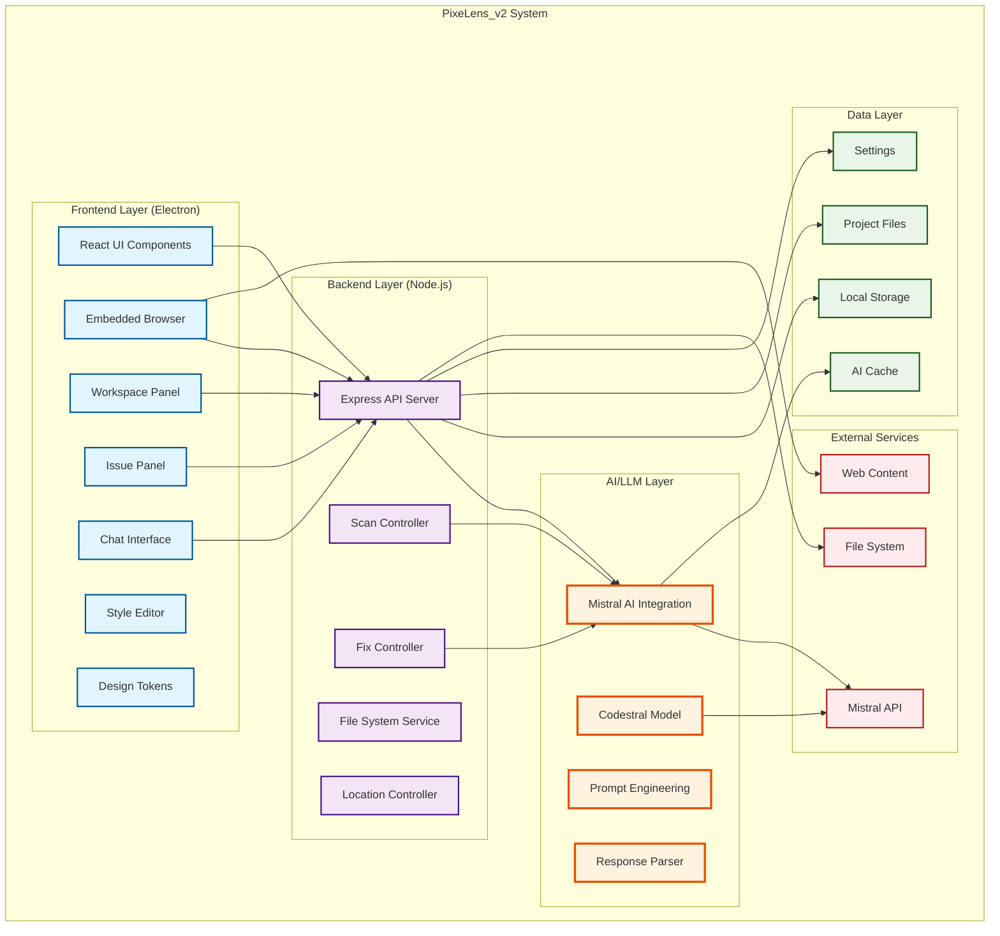
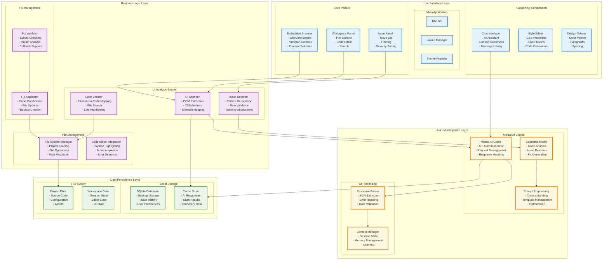
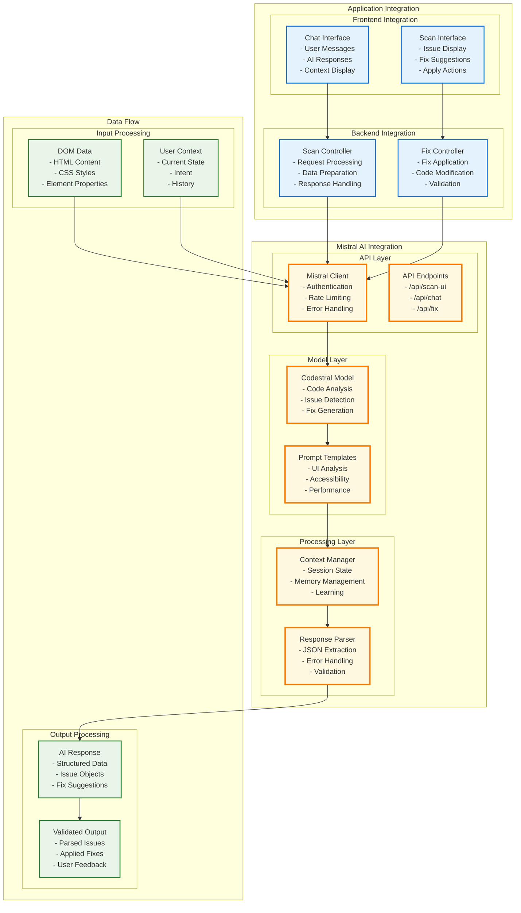
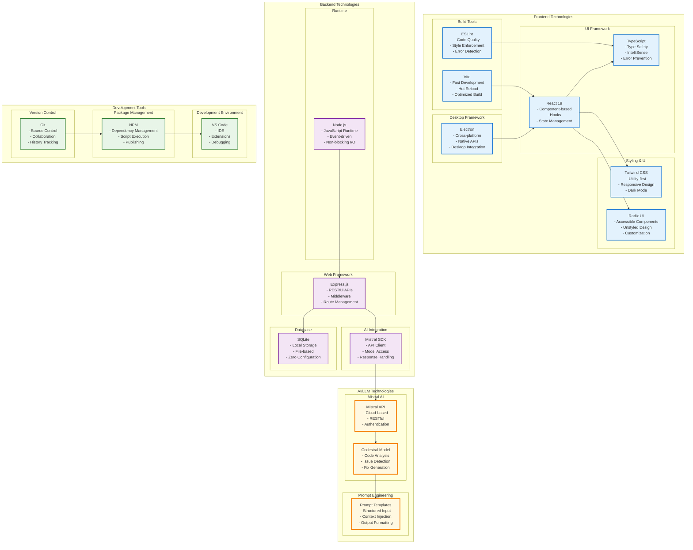

# PixeLens_v2 Architecture - Mermaid Diagrams

## 1. High-Level System Architecture

## 2. Detailed Component Architecture

## 3. Data Flow Architecture

```mermaid
flowchart TD
    subgraph "User Interaction"
        USER[Developer User]
        UI_ACTION[UI Action<br/>- Scan Button<br/>- Fix Button<br/>- Element Selection]
    end
    
    subgraph "Frontend Processing"
        DOM_EXTRACT[DOM Extraction<br/>- HTML Content<br/>- CSS Styles<br/>- Element Properties]
        CONTEXT_BUILD[Context Building<br/>- Current State<br/>- User Intent<br/>- Project Context]
    end
    
    subgraph "Backend Processing"
        REQUEST_HANDLER[Request Handler<br/>- API Endpoints<br/>- Data Validation<br/>- Route Management]
        SCAN_ENGINE[Scan Engine<br/>- Issue Detection<br/>- Pattern Analysis<br/>- Severity Calculation]
    end
    
    subgraph "AI/LLM Processing"
        MISTRAL_API[Mistral API Call<br/>- Codestral Model<br/>- Prompt Injection<br/>- Response Streaming]
        AI_ANALYSIS[AI Analysis<br/>- Code Review<br/>- Issue Identification<br/>- Fix Suggestions]
        RESPONSE_PROCESS[Response Processing<br/>- JSON Parsing<br/>- Error Handling<br/>- Data Structuring]
    end
    
    subgraph "Result Processing"
        ISSUE_GENERATION[Issue Generation<br/>- Structured Issues<br/>- Severity Levels<br/>- Fix Recommendations]
        FIX_APPLICATION[Fix Application<br/>- Code Modification<br/>- File Updates<br/>- Validation]
    end
    
    subgraph "Feedback Loop"
        UI_UPDATE[UI Update<br/>- Issue Display<br/>- Visual Feedback<br/>- Status Updates]
        USER_FEEDBACK[User Feedback<br/>- Accept/Reject<br/>- Manual Edits<br/>- Learning Input]
    end
    
    %% Flow connections
    USER --> UI_ACTION
    UI_ACTION --> DOM_EXTRACT
    DOM_EXTRACT --> CONTEXT_BUILD
    CONTEXT_BUILD --> REQUEST_HANDLER
    
    REQUEST_HANDLER --> SCAN_ENGINE
    SCAN_ENGINE --> MISTRAL_API
    MISTRAL_API --> AI_ANALYSIS
    AI_ANALYSIS --> RESPONSE_PROCESS
    
    RESPONSE_PROCESS --> ISSUE_GENERATION
    ISSUE_GENERATION --> FIX_APPLICATION
    FIX_APPLICATION --> UI_UPDATE
    UI_UPDATE --> USER_FEEDBACK
    USER_FEEDBACK --> USER
    
    %% Styling
    classDef user fill:#e8f5e8,stroke:#2e7d32,stroke-width:2px
    classDef frontend fill:#e3f2fd,stroke:#1976d2,stroke-width:2px
    classDef backend fill:#f3e5f5,stroke:#7b1fa2,stroke-width:2px
    classDef ai fill:#fff8e1,stroke:#f57c00,stroke-width:3px
    classDef result fill:#fff3e0,stroke:#e65100,stroke-width:2px
    classDef feedback fill:#fce4ec,stroke:#c2185b,stroke-width:2px
    
    class USER,UI_ACTION user
    class DOM_EXTRACT,CONTEXT_BUILD,UI_UPDATE frontend
    class REQUEST_HANDLER,SCAN_ENGINE backend
    class MISTRAL_API,AI_ANALYSIS,RESPONSE_PROCESS ai
    class ISSUE_GENERATION,FIX_APPLICATION result
    class USER_FEEDBACK feedback
```

## 4. LLM Integration Architecture

## 5. Technology Stack Architecture

## Usage Instructions

These Mermaid diagrams can be used in:

1. **GitHub README**: Embed directly in markdown files
2. **Documentation**: Technical documentation and architecture guides
3. **Presentations**: Convert to images for PowerPoint presentations
4. **Development**: Team understanding and onboarding

### Key Features Highlighted:

- **Frontend (Electron + React)**: Desktop application with modern UI
- **Backend (Node.js + Express)**: API server with file system integration
- **AI/LLM (Mistral + Codestral)**: Advanced code analysis and issue detection
- **Data Flow**: Complete request-response cycle with AI processing
- **Technology Stack**: Comprehensive view of all technologies used

The diagrams emphasize the **LLM technologies** (Mistral AI, Codestral model) with special highlighting and show how they integrate with both frontend and backend components. 