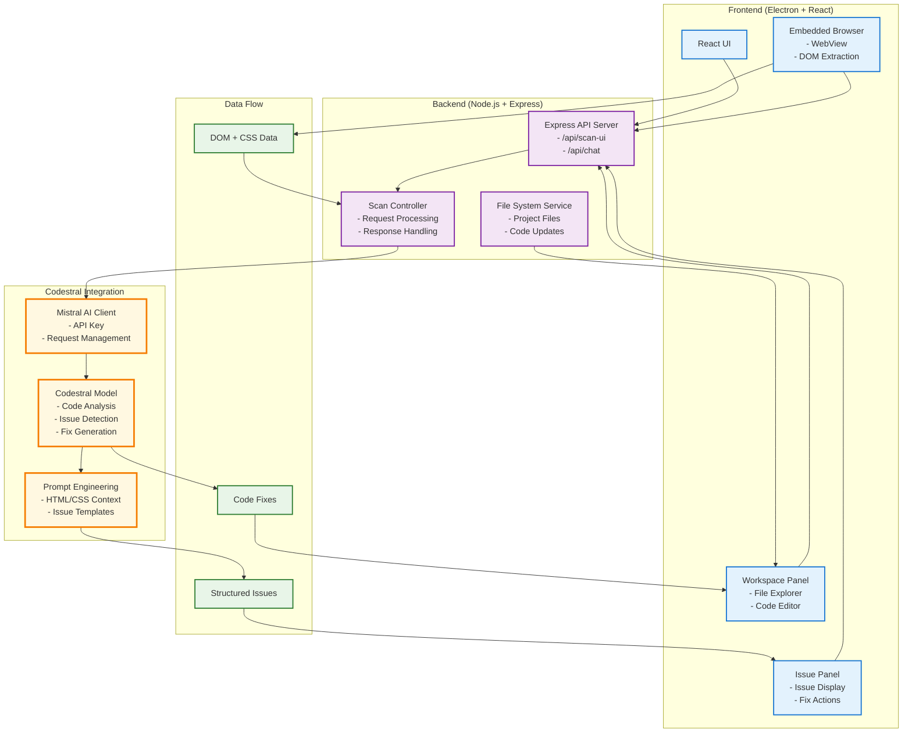

# PixeLens_v2 Architecture - Frontend-Backend-Codestral

## How It Works:

1. **Frontend** extracts DOM/CSS from embedded browser
2. **Backend** receives data via Express API
3. **Codestral** analyzes code and generates issues/fixes
4. **Backend** processes results and updates files
5. **Frontend** displays issues and applies fixes 