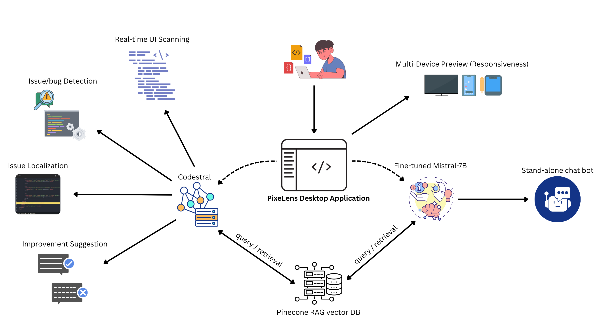
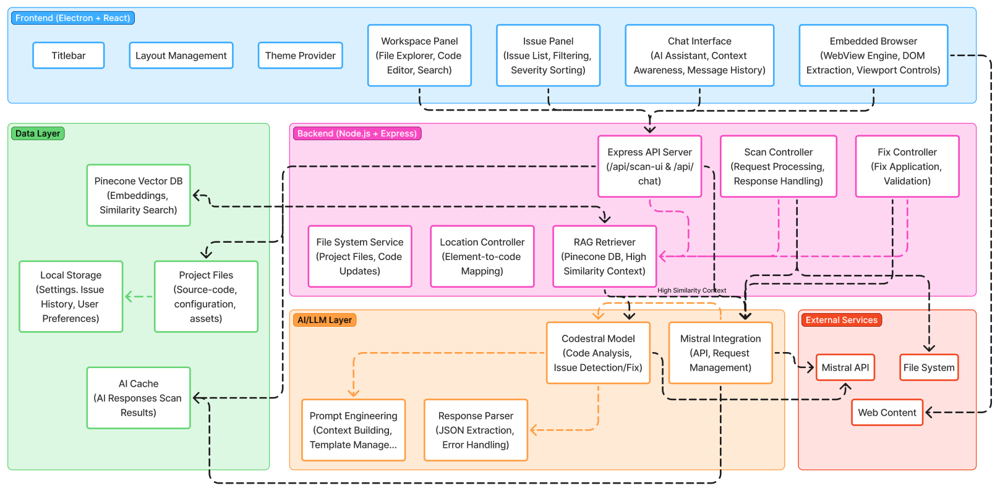

# **PixeLens**  
*Enhancing UI/UX Debugging with Memory-Efficient RAG and LLM Integration*

---
## **Architecture**
Functionality Diagram


LLM Architecture



## **Performance Highlights**
| **Metric** | **Result** |
|--------|--------|
| CodeBERT Similarity | 97.36% |
| RAG Retrieval Precision (Top-5) | 89.98% |
| LLM-as-a-Judge Score | 7.86 / 10 |
| User Satisfaction | 8.3 / 10 |

## **Fine-tuning**
The dataset for fine-tuning was made by *scraping stackoverflow issues* with specific tags (react.js, next.js, etc.). 
- This dataset was then used to fine-tune the `open-mistral-7b` model on **Mistral Console**.
- We also performed fine-tuning using *Axolotl* on a [Kaggle  notebook](https://www.kaggle.com/code/anikait05/mistral-finetuning-axolotl) with **GPU T4 x2** accelerator and pushed the model to [HuggingFace Repository](https://huggingface.co/anikait-colab/mistral-7B-ui-ux-finetuned).


## **Project Setup**

### **1. Clone the Repository**
```bash
git clone https://github.com/br34dcrumb/PixeLens.git
cd pixelens
```

### **2. Setup Python Virtual Environment**
```bash
python3 -m venv .venv
source .venv/bin/activate
```

### **3. Install NodeJS environment**
```bash
pip install -r requirements.txt
nodeenv -p --node=22.13.0
```

### **4. Run the frontend**
```bash
cd frontend/
npm run dev
```

### **5. Start the backend (another terminal session)**
```bash
cd backend/
npm run start
```